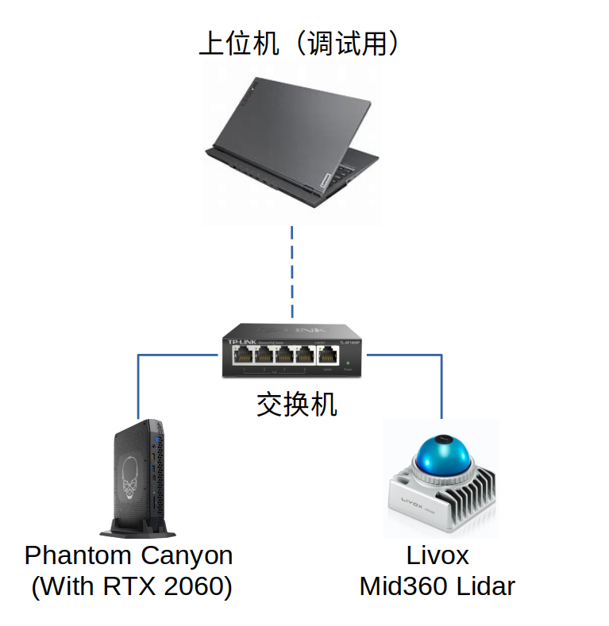

# TUP2023-Sentry-Framework
沈阳航空航天大学TUP战队2023年哨兵框架

## 1.简介
本套框架是沈阳航空航天大学TUP战队2023赛季哨兵程序框架。本框架基于ROS2 Galactic开发,各模块间高度解耦，方便开发维护。
## 2.软件环境

|软件|安装方式|版本|
|---|---|---|
|Ubuntu|编译安装(实时内核)|20.04 LTS + Real-Time Kernel|
|OpenVINO™ toolkit|编译安装|2022.3 LTS|
|ROS2|apt安装|Galactic|
|OpenCV|编译安装/apt安装|4.6.0|
|Ceres|编译安装|2.1.0|
|Eigen|编译安装|3.4.0|

## 3. 硬件方案
### 3.1 传感器
|传感器|类型|数量|作用|
|---|---|---|---|
|OAK-D-PRO-W|深度相机|1|导航/全向感知|
|大恒MER-139|工业相机|1|自瞄|
|KS2A543|USB摄像头|3|全向感知|
### 3.2 计算平台
经过我们的测试，SLAM任务和自瞄任务对系统资源的占用均较大，将这两个任务放在一台设备上运行并不现实。因此我们在哨兵上安装了两台NUC，分别运行我们的导航与自瞄程序。两台NUC通过一台交换机进行组网，通过网线进行通讯。上位机可以通过采用接入交换机方式来使用局域网访问两台下位机，方便调试。

## 4.软件设计
### 4.1 简介
哨兵程序基于ROS2 Galactic进行开发.
参考RMOSS的设计模式，我们将系统分为以下三层:`Task Layer`, `Interface Layer`,`Hardware Layer`.
- **Task Layer**:该层主要分为四个模块:
`Autoaim`为自瞄模块，负责探测敌人并进行击打。
`Decision`为决策模块，负责综合目前可以获得到的各种信息，决定下一个所需前往下一个路径点，下一个击打模板与车辆的模式。
`Navigation`为导航模块，负责进行SLAM和路径规划，将车辆送到下一个路径点，并运行VIO
`Perception`为感知模块，负责使用CNN探测周围敌方车辆，补足自瞄盲区，进行360度全向感知。
这4个节点分开运行在两台NUC上，相互间通过网线进行通讯
- **Interface Layer**:改层主要为各种设备的ROS驱动，负责将图像等信息发布为Topic,或从Topic中获取message并将其按通讯协议发送给下位机。
- **Hardware Layer**:该层主要为各种硬件设备与传感器，负责感知外部信息和动作的具体执行。

通过这种设计模式，我们可以实现硬件与应用层的解耦，方便进行程序的快速移植。针对各个模块的详细介绍可以进入对应仓库内的README查看。

## 5.通讯协议
今年哨兵通讯仍旧采用USB-CDC模拟串口。哨兵作为全自动兵种，所需要获取的信息相较步兵、英雄等其他兵种更多。为了更加合理且充分的运用这些信息，我们采取了分包发送的形式，便于灵活的控制各信息的发送频率。
### TX:
#### 1.Aim
|Byte|Data|
|-|-|
|0|0xA5|
|1|mode|
|2|CRC8|
|3-6|Pitch|
|7-10|Yaw|
|11-14|Distance|
|15|isSwitched|
|16|isFindTarget|
|17|isSpinning|
|18|isMiddle|
|19-61|Empty|
|62-63|CRC16|
#### 2.Nav
|Byte|Data|
|-|-|
|0|0xB5|
|1|mode|
|2|CRC8|
|3-14|Linear Twist(XYZ)|
|15-26|Angular Twist(XYZ)|
|27-61|Empty|
|62-63|CRC16|

#### 3.Decision
|Byte|Data|
|-|-|
|0|0xC5|
|1|mode|
|2|CRC8|
|3-6|Theta Gimbal|
|7-61|Empty|
|62-63|CRC16|

### RX:
