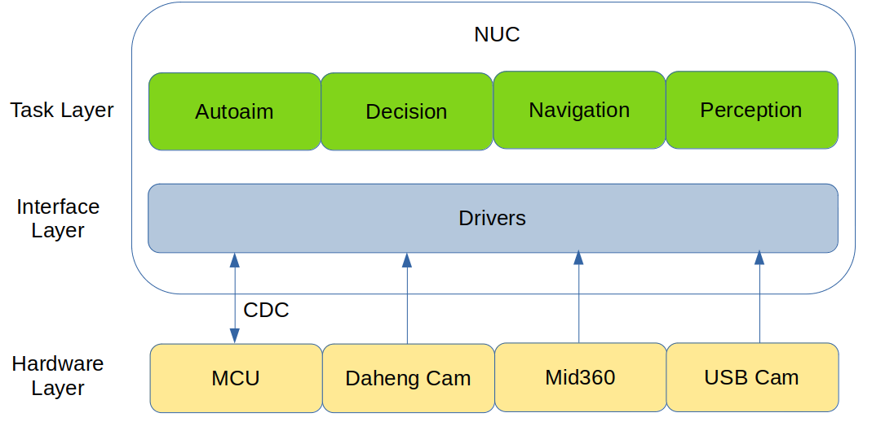

# TUP2023-Sentry-Framework
沈阳航空航天大学TUP战队2023年哨兵框架

## 1.简介
本套框架是沈阳航空航天大学TUP战队2023赛季哨兵程序框架。本框架基于ROS2 Galactic开发,各模块间高度解耦，方便开发维护。

该分支为LIO分支，目前仍在开发中。
## 2.软件环境

|软件|安装方式|版本|
|---|---|---|
|Ubuntu|编译安装(实时内核)|20.04 LTS + Real-Time Kernel|
|CMake|编译安装|3.22|
|OpenVINO™ toolkit|编译安装|2022.3 LTS|
|ROS2|apt安装|Galactic|
|OpenCV|编译安装/apt安装|4.6.0|
|Ceres|编译安装|2.1.0|
|Eigen|编译安装|3.4.0|
|depthai-core|编译安装|2.21.2|
|matplotlib-cpp|编译安装|N/A|

## 3. 硬件方案
### 3.1 传感器
|传感器|类型|数量|作用|
|---|---|---|---|
|MID360|激光雷达|1|导航|
|大恒MER-139|工业相机|1|自瞄|
|KS2A543|USB摄像头|4|全向感知|
## 4.软件设计
### 4.1 简介
哨兵程序基于ROS2 Galactic进行开发.
参考RMOSS的设计模式，我们将系统分为以下三层:`Task Layer`, `Interface Layer`,`Hardware Layer`.
- **Task Layer**:该层主要分为四个模块:
`Autoaim`为自瞄模块，负责探测敌人并进行击打。
`Decision`为决策模块，负责综合目前可以获得到的各种信息，决定下一个所需前往下一个路径点，下一个击打模板与车辆的模式。
`Navigation`为导航模块，负责进行SLAM和路径规划，将车辆送到下一个路径点，并运行VIO
`Perception`为感知模块，负责使用CNN探测周围敌方车辆，补足自瞄盲区，进行360度全向感知。
这4个节点分开运行在两台NUC上，相互间通过网线进行通讯
- **Interface Layer**:改层主要为各种设备的ROS驱动，负责将图像等信息发布为Topic,或从Topic中获取message并将其按通讯协议发送给下位机。
- **Hardware Layer**:该层主要为各种硬件设备与传感器，负责感知外部信息和动作的具体执行。

通过这种设计模式，我们可以实现硬件与应用层的解耦，方便进行程序的快速移植。针对各个模块的详细介绍可以进入对应仓库内的README查看。


## 5.通讯协议
今年哨兵通讯仍旧采用USB-CDC模拟串口。哨兵作为全自动兵种，所需要获取的信息相较步兵、英雄等其他兵种更多。为了更加合理且充分的运用这些信息，我们采取了分包发送的形式，便于灵活的控制各信息的发送频率。
### TX:
#### 1.Aim
|Byte|Data|
|-|-|
|0|0xA5|
|1|mode|
|2|CRC8|
|3-6|Pitch|
|7-10|Yaw|
|11-14|Distance|
|15|isSwitched|
|16|isFindTarget|
|17|isSpinning|
|18|isMiddle|
|19-61|Empty|
|62-63|CRC16|
#### 2.Nav
|Byte|Data|
|-|-|
|0|0xB5|
|1|mode|
|2|CRC8|
|3-14|Linear Twist(XYZ)|
|15-26|Angular Twist(XYZ)|
|27-61|Empty|
|62-63|CRC16|

#### 3.Decision
|Byte|Data|
|-|-|
|0|0xC5|
|1|mode|
|2|CRC8|
|3-6|Theta Gimbal|
|7-61|Empty|
|62-63|CRC16|

### RX:

## 6.使用教程

### 6.1 建图
要使用导航模块，你需要首先建立场地的地图
- 八叉树地图 - 用于重定位
- 点云地图 - 用于后续生成2.5D高程地图
- 2.5D高程地图 - 用于生成栅格地图
- 栅格地图 - 用于作为导航的全局地图

```bash
cd scripts
bash octo_mapping.sh
```
使用该命令以启动建图，可以打开rviz2观看建图效果
### 6.1.1 八叉树地图
当完成建图后，在工作空间下打开新终端使用以下命令保存八叉树地图
```bash
source install/setup.bash
ros2 launch octomap_server octomap_saver.launch.xml
```
可使用octovis查看八叉树地图

### 6.1.2 点云地图
该步骤与八叉树建图同时进行
在工作空间下打开新终端使用以下命令保存地图
```bash
source install/setup.bash
ros2 service call /lio_sam/save_map lio_sam/srv/SaveMap
```


### 6.1.3 2.5D高程地图与栅格地图
该步骤应在上面两步完成后进行，生成的地图将用于机器人导航

修改`TUP2023-Sentry-Nav/grid_map/grid_map_demos/config/pcd_to_gridmap_demo.yaml`中参数以符合你的需求
```yaml
pcd_to_gridmap:
  ros__parameters:
    #PCD地图路径
    pcd_file_path: "/home/tup/Downloads/LOAM/GlobalMap.pcd"
    #建图frame_id
    map_frame_id: "map"
    #滤波相关参数
    filters:
        ...
```

如果你需要pcd点云如翻转，平移，滤波之类的预处理，你可以修改`TUP2023-Sentry-Nav/grid_map/grid_map_demos/config/pcl_grid_config.yaml`中的配置以满足你的需求。

完成配置后启动程序
```bash
source install/setup.bash
ros2 launch grid_map_demos pcd_to_gridmap_demo_launch
```
以下为`height_layer`为`elevation`，`color_layer`为`slope_grid`生成的2.5D高程地图


在该配置下，可自打开rviz，你可以看到`/elevation_grid`, `slope_grid`
Topic下的栅格地图.

使用类似以下命令的以保存地图.
```bash
ros2 run nav2_map_server map_saver_cli -f your_map_name -t /your_map_topic_name
```
以下为使用`slope_grid`生成的2d栅格地图，可使用GIMP稍加修改离群像素，之后便可直接用于nav2导航
